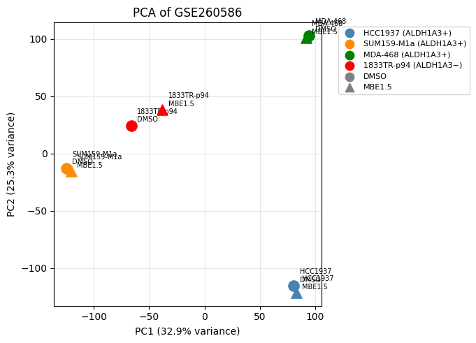
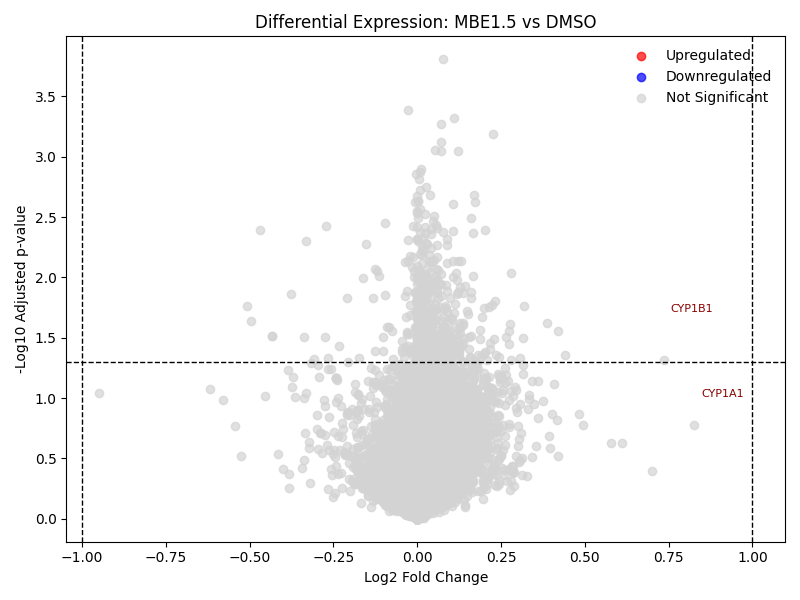

# Secure Genomic Data Analysis 

## OVERVIEW:
RNA-seq analysis workflow demonstrating QC and exploratory analysis, normalization PCA, basic differential exploration, and a short data integrity demo. 

## PROJECT GOALS:
- Demonstrate QC, normalization PCA, and basic DE analysis on a small public dataset
- Show simple data integrity and encryption demonstration for secure genomics workflows

## BIOLOGICAL CONTEXT: 
Aldehyde dehydrogenase 1a3 (ALDH1A3) converts retinaldehyde into all-trans retinoic acid (atRA) which was historically assumed to suppress tumors. This study shows that ALDH1A3-expressing cancers lose sensitivity to retinoid signaling. Instead, the atRA produced by ALDH1A3 acts in a paracrine fashion to suppress anti-tumor immunity rather than acting on the tumor cells themselves. The researchers developed MBE1.5, an ALDH1A3 inhibitor, to observe how ALDH1A3 inhibition changes gene expression in cancer cell lines (Esposito et al., 2025, iScience 28, 113675).

## EXPERIMENTAL DESIGN: 
Four breast cancer cell lines - MDA-MB-468, SUM159-M1a, and HCC1937 (ALDH1A3 positive) and 1833TR-p94 (ALDH1A3 negative) - were treated with inhibitor MBE1.5 vs 0.1% DMSO control for 9 hours. Total RNA was harvested and transcriptome-wide expression was measured by RNA-seq.

## DATA: 
GSE260586 (FPKM+1)

## REPO STRUCTURE
- 'data/raw/' raw input files (GSE260586_FPKM+1.txt)
- 'data/processed/' Log2 expression data
- 'notebooks/' Jupyter notebooks
- 'src/' scripts
- 'results/figures/' figures and outputs

## NOTEBOOKS
1. 01_exploratory_analysis
Performed initial inspection and normalization of the expression matrix and explored global variance structure. Goals were to identify large-scale variance patterns, verify normalization behavior, and provide initial assessment of treatment effects. 
2. 02_stats_and_DE
Differential expression was assessed across four breast cancer cell lines, comparing MBE1.5 treatment to DMSO controls within each cell line. Log2 fold changes were computed as the mean paired difference, and significance was assessed using a paired t-test.
3. 03_pca_analysis
Validated PCA results using R to demonstrate cross-language reproducibility. Confirmed that observed variance structure is not dependent on a specific software system.
4. 04_security_demo
Demonstrated basic secure data handling concepts relevant to genomic workflows. Demonstrated hashing and encryption to show awareness of data integrity and secure computational practices.

## TOOLS:
Python, R, pandas, numpy, scipy, matplotlib, scikit-learn, Git

## COMPARISON TO PUBLISHED FINDINGS:
Calculated PCA scores (PC1: 32.9%, PC2: 25.3%) closely match published values (PC1: 32.46%, PC2: 25.63%) (Esposito et al., 2025, iScience 28, 113675). Consistent with Figure 4E of the paper, clustering observed in PCA is due to cell line grouping rather than treatment with MBE1.5 or DMSO. 

CYP1A1 and CYP1B1 appear as top upregulated genes, consistent with experimental findings which identified these as off-target aryl hydrocarbon receptor responses to MBE1.5 (Esposito et al., 2025, iScience 28, 113675). The absence of other significant hits corroborates the paper's conclusion that ALDH1A3 inhibition produces no cell-intrinsic transcriptomic response in these retinoid-insensitive cell lines.

## NOTES & LIMITATIONS:
Sample grouping was derived from GEO Series metadata describing treatment with both MBE1.5 and DMSO control across four breast cancer cell lines. Due to limited sample size, differential expression analysis serves as methodological demonstration for educational purposes. More robust methods, such as DESeq2, are used for definitive biological inference. The security demonstration is conceptual and educational, not a production deployment.

## Citations
1. Esposito M, Fang C, Wei Y, Pozzan A, Beato C, Su X, Hutton JE III, Reed T, Hang X, Perini ED, Wang W, Cheng X, Pan Y, Yu J, Kane M, Manoharan M, Proudfoot J, Cristea IM, Kang Y. Development of retinoid nuclear receptor pathway antagonists through targeting aldehyde dehydrogenase 1A3. *iScience*. 2025;28:113675. https://doi.org/10.1016/j.isci.2025.113675